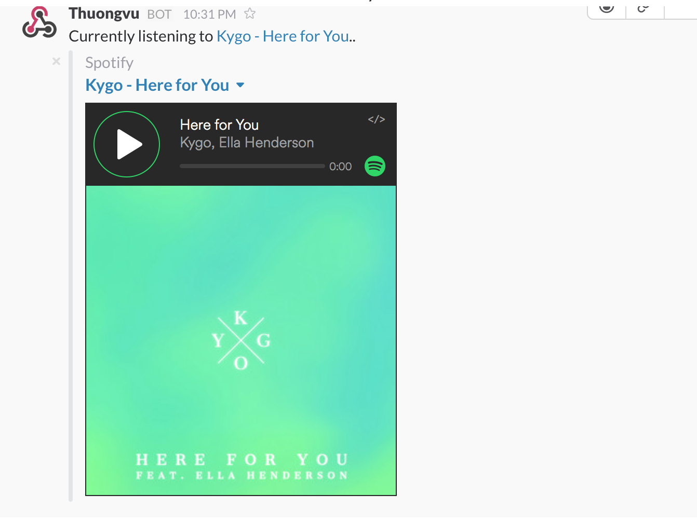

# share-spotify-track-slack

A CLI tool that shares the current Spotify song you're listening to in a Slack channel of your choice.  Works on Mac OSX.

## Usage
Set up an [incoming web hook](https://api.slack.com/incoming-webhooks) for Slack.

Set the config variables in `share-spotify-track-slack.applescript` to your choosing.

Run `make` to build `share-spotify-track-slack.scpt`.

```
property channel : "#random"
property username : "Thuongvu"
property webhook : "WEBHOOK_URL"
```

Run `osascript share-spotify-track-slack.scpt` in your terminal.

Results in
```

```
